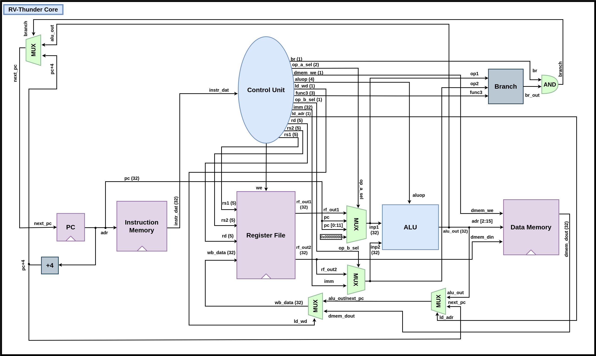

# RISC-V Thunder Core (Using Amaranth HDL)

 RISC-V Thunder Core is a 32-bit CPU core that currenly implements the [RISC-V](https://riscv.org/) RV32I instruction set. Its microarchitecture is described in plain Python code using [Amaranth HDL](https://amaranth-lang.org/docs/amaranth/latest/). There is one main file [rv-thunder.py](src/rv-thunder.py)

 ## Features

 * Written in user-friendly language Python's framework (amaranth HDL)
 * Support instruction set architecture of RISC-V 32I
 * 8KB Instruction and data memory
 * 32 general purpose registers
 * Test bench (using Amaranth HDL)

 ## Block Diagram
 
 ## Testing

 A testbench for RISC-V Thunder Core is available [here](https://github.com/merledu/rv-thunder/tree/main/test).

 ## About Amaranth HDL

 Amaranth HDL is a hardware description language (which was previously known as nMigen) used for designing digital circuits and systems. It allows hardware engineers to specify the behavior and structure of digital designs, which can be synthesized into actual hardware using tools like [Yosys](https://github.com/YosysHQ/yosys) or translated into Verilog code. It's used for FPGA and ASIC design.
 
 ## Prerequisites

 Before working on this project, ensure you have the following prerequisites:
 * Python's library [Amaranth HDL](https://amaranth-lang.org/docs/amaranth/latest/) 
 * [iVerilog](https://github.com/steveicarus/iverilog)
 * [GTKWave](https://gtkwave.sourceforge.net/) 

 ## Amaranth HDL docs

 Install Amaranth HDL and other platforms (GTKWave, etc) using the installation method and also clone git given in [Language guide](https://amaranth-lang.org/docs/amaranth/latest/)
 
  For a basic understanding of Amaranth HDL use [Robert Baruch's introduction](https://github.com/RobertBaruch/nmigen-tutorial)

 ## Acknowledgement
 We want to express our gratitude to the RISC-V community for their valuable contributions to the open-source hardware ecosystem. Additionally, thanks to the Amaranth HDL developers for providing a platform for hardware design.
